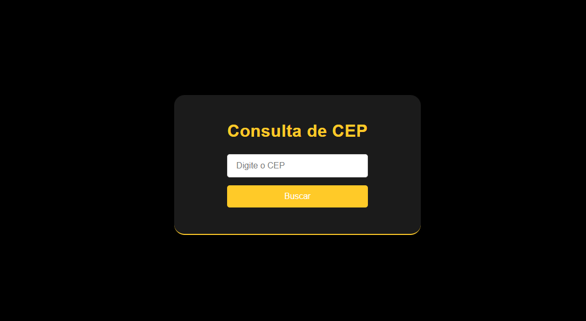
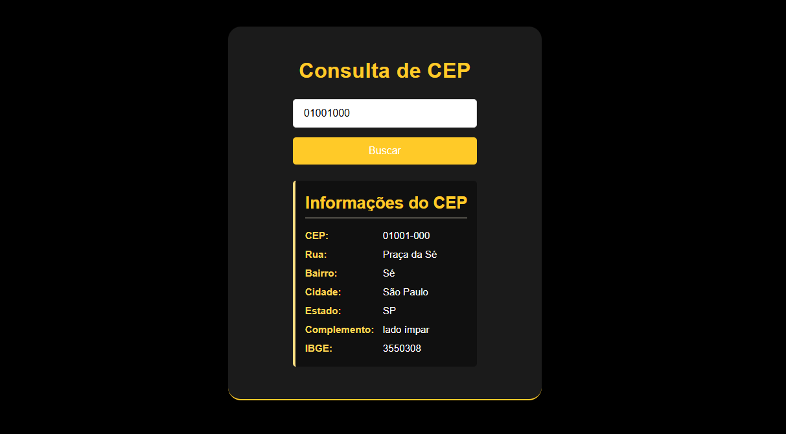

# Consulta de CEP




## Descrição

**Consulta de CEP** é uma aplicação web simples e elegante construída com **React** e **Vite**. Ela permite aos usuários consultar informações detalhadas sobre um CEP (Código de Endereçamento Postal) brasileiro utilizando a API do [ViaCEP](https://viacep.com.br/). A interface minimalista garante uma experiência de usuário agradável e intuitiva.

## Funcionalidades

- **Entrada de CEP**: Campo de input para o usuário digitar o CEP desejado.
- **Busca de Informações**: Botão para buscar as informações relacionadas ao CEP inserido.
- **Exibição de Resultados**: Apresenta detalhes como rua, bairro, cidade, estado, complemento e IBGE de forma organizada.
- **Design Responsivo**: Adapta-se a diferentes tamanhos de tela, garantindo usabilidade em dispositivos móveis e desktops.
- **Feedback de Erro**: Mensagens claras em caso de CEP inválido ou não encontrado.

## Tecnologias Utilizadas

- [React](https://reactjs.org/)
- [Vite](https://vitejs.dev/)
- [CSS](https://developer.mozilla.org/pt-BR/docs/Web/CSS)

## Instalação

### Pré-requisitos

- [Node.js](https://nodejs.org/) (v14 ou superior)
- [npm](https://www.npmjs.com/) ou [Yarn](https://yarnpkg.com/)

### Passos

1. **Clone o repositório**

   ```bash
   git clone https://github.com/seu-usuario/consulta-de-cep.git
